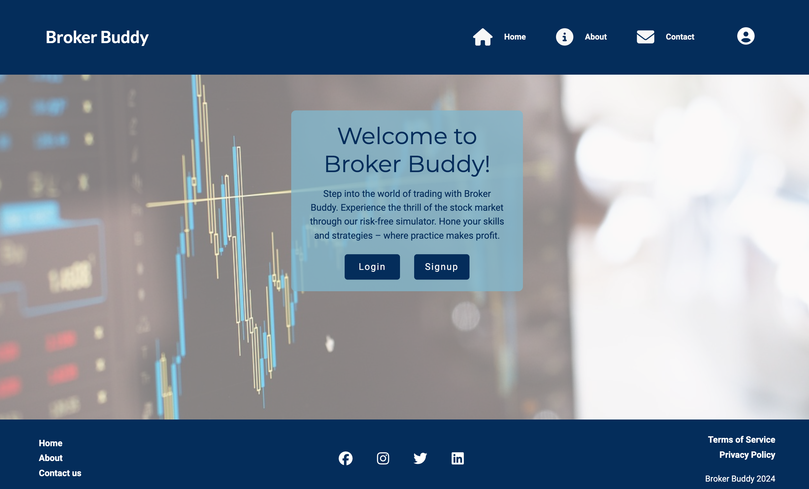
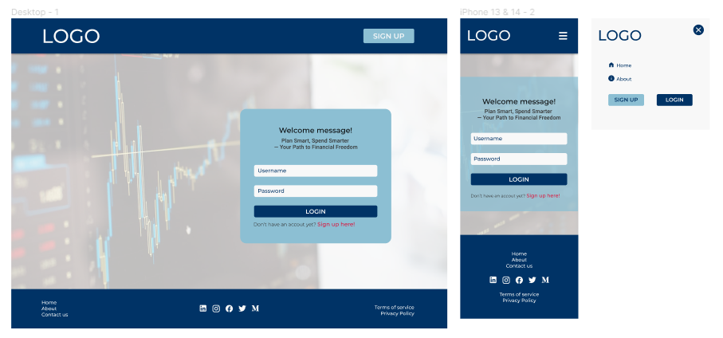
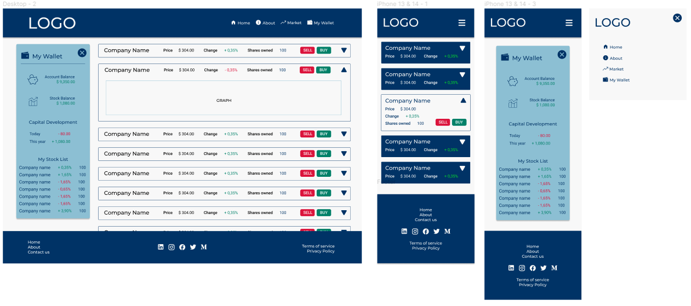
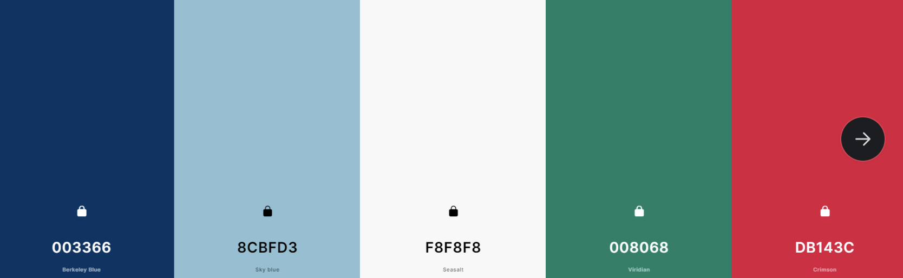
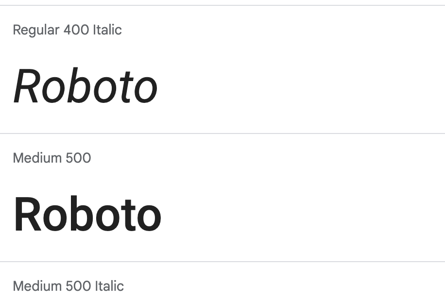
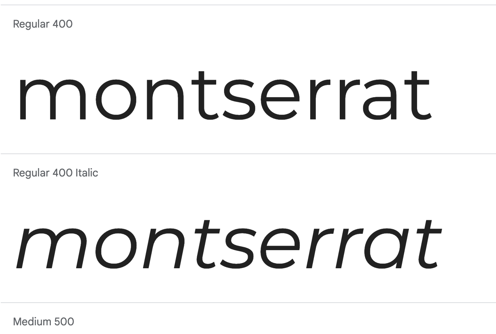

<h1 align= "center"><strong>💲💲💲 Broker Buddy |  New Year, January Hackathon 2024, 💲💲💲</strong></h1>

[Click for live view](https://finflare-9057c20c8176.herokuapp.com/)

<!-- The website picture here -->

## Table of Contents

Click to go to Contents here 

[About the project](#about-the-project) 

- [Wireframes](#Wireframes)
- [Colour Scheme](#Colour-Scheme)
- [Imagery](#Imagery)

[Target audience](#target-audience)

[User Experience UX](#user-experience-ux)

 - [User stories](#user-stories)
 - [Design](#design)

[Typography](#typography)
- [Background](#background)
- [Fonts](#fonts)

[Features](#features)

 - [Composition of the Website](#composition-of-the-website)
 - [Navbar](#navbar)
 - [Animations](#animations)
 - [Footer](#footer)

[Future feature](#future-feature)

[Technology used](#technology-used)

[Tools](#tools)

[Testing](#testing)
 - [Lighthouse](#lighthouse-report)
 - [Manual testing](#manual-testing)
 - [Test on browsers](#test-on-browsers)
 
[Deployment](#deployment)
 
[Fixed Bugs](#fixed-bugs)

[Credits](#credits)
 - [Conclusion](#conclusion)

[Acknowledgements](#acknowledgements)

## About the project

<strong>Broker Buddy</strong> is a website designed to assist users and individuals who are skilled in the complex field of stock investing. It is a platform that is motivated by financial growth and aims to streamline the path to long-term investment success. Whether the user is a seasoned investor or a novice, the platform is committed to helping users achieve financial growth by streamlining the path to long-term investment success. With a user-friendly interface and a vast array of powerful tools, Broker Buddy is a one-stop shop for all things related to stock investing.

## Objectives

- The main goal of financial stock investing is to achieve capital growth over time.
    
    It is for users and investors who aim to increase the value of their investment portfolio by purchasing stocks with the potential for appreciation. Capital growth can be realized through the increase in the market value of individual stocks or the overall performance of the stock market. This objective aligns with the long-term strategy of building wealth and achieving financial goals, such as funding education, retirement, or major life events.

 
- To generate a steady stream of income through dividends and other income-generating  stocks.

 - The website has a landing page where users can log in and access the market stocks. It also has an About page that provides users with insight into Brokers Buddy and its team. There is a Contact page that users can use to get in touch with the company representative for further services. Additionally, there is a Login page for user access. Each page is designed with aesthetics in mind to provide users with a visually stimulating and easy-to-use interface. Users will also experience a unique end animation.

## Target audience

  - The website is tailored for individuals who aspire to delve into stock market investments with a focus on achieving financial growth. It is meticulously designed to cater to the needs and preferences of users seeking a visually captivating and user-friendly platform for their investment journey.

  - Individuals who are eager to initiate their journey into stock market investing, looking for a platform that provides comprehensive resources, guidance, and a user-friendly interface.

  - Investors who prioritize long-term financial growth and wealth accumulation through strategic stock market investments.

  - Users who appreciate and engage more effectively with visually striking and well-designed interfaces.

  - Users comfortable with technology and keen on utilizing a modern and well-designed platform for their stock market investments.

### Wireframes

  - 

***

  - 

***

## User Experience (UX)

### User stories

  - To be able to view the site on a range of device sizes.
  - To facilitate simultaneous navigation for users while trading.
  - To ensure that users experience high-performance interactivity while investing and trading.

#### First Time Visitor Goal

  - I want to find out about the Broker Buddy if I can access the stock market.
  - I want to easily navigate the site and access different parts of the platform.
  - I would like to know about the trading capital of investment.

#### Returning Visitor Goal

  - I want to know what improvements have been made in the stock market.
  - I want to invest in different stocks.

#### Frequent Visitor Goal

  - I want to recommend the Broker Buddy to friends.

## Design

### Color Scheme

Our color palette has been carefully selected to reflect the professional yet approachable nature of Broker Buddy. Each color has been chosen to ensure accessibility and to enhance the user experience. 

Navy Blue (#003366): Symbolizes trust, responsibility, and professionalism. Used predominantly in our logo and headers to convey reliability. 

Sky Blue (#8CBFD3): Evokes a sense of clarity and calmness. It's used for accents and to highlight important features within the app. 

Off-White (#F8F8F8): Provides a clean, minimalistic background that enhances readability and ensures content stands out. 

Teal (#008068): Represents growth and balance. Applied to elements indicating positive trends or actions, like successful transactions. 

Crimson (#DB143C): Grabs attention and signals importance. It is used sparingly for alerts and critical action items, such as error messages or urgent notifications. 

### Typography

#### Background
  A background image with stock candles theme was added to the webpage to give a 3D effect and make the heading area look more interactive.
  As users might expect, they want to feel immersed in the trading market atmosphere, so the team opted for a background that is visually appealing and gives the right impression.

#### Fonts

After careful consideration, the team decided to use the fonts Roboto, Montserrat, and Sans-serif as a fallback font for the text on screens of all sizes. We believe that these fonts offer a great combination of aesthetic appeal and readability, and will help to enhance the overall user experience. Our typography choices aim to balance readability with personality, ensuring a seamless reading experience across all devices and platforms.

Primary Font: Roboto – A modern sans-serif typeface that is clear and easy to read. Used for body text and data presentation.

   

Secondary Font: Montserrat – A geometric sans-serif typeface with a contemporary feel. Used for headings and titles to add character to the page layouts.

 

 Both fonts are available through Google Fonts, ensuring they are easily accessible and web-safe.  

## Features

### Composition of the Website

  The website is organized into three distinct web pages such as the Landing page, the About Page, Contact page and the Login page. The website has a landing page where users can log in and access the market stocks. It also has an About page that provides users with insight into Brokers Buddy and its team. There is a Contact page that users can use to get in touch with the company representative for further services. Additionally, there is a Login page for user access.

## Technologies Used

- [HTML](https://developer.mozilla.org/en-US/docs/Web/HTML) | was used to build the structure of the website.

- [CSS](https://developer.mozilla.org/en-US/docs/Web/css) | was used to add style the website.

- [JavaScript](https://pythontutor.com/javascript.html#mode=edit) | was used to add dynamism and interactivity to the website.

- [BootStrap](https://getbootstrap.com/) | was used to add positioning and responsiveness to the website.

- [VS Code](https://code.visualstudio.com/) | was used as the IDE to write, edit, merge, and push codes.

- [Git](https://git-scm.com/) | was used for the version control of the website.

- [GitHub](https://github.com/) | was used to host the code of the website and for deployment.

## Tools

  - [Pixabay](https://pixabay.com/) | was used to get favicon for website.

  - [Canva](https://www.canva.com/) | was used to edit images for website.

  - [Font Awesome](https://fontawesome.com/) | was used to select icons for website.

  - [I Am Responsive](https://ui.dev/amiresponsive) | was used to check website responsiveness on all devices.

  - [Tiny](https://tinypng.com/) | was used to optimise images for website.

  - [Color Name](https://www.color-name.com/) | was used to detect color names.

  - [MS Word](https://en.wikipedia.org/wiki/Microsoft_Word) | used to correct the grammar.

***

## Testing

## Deployment

### Github Pages

- #### Fork a Repository
1. Find the repository you want to fork
2. Find the 'Fork' button to create a new fork
3. When creating the fork, the name and description can be changed
4. Click 'Create fork'

- #### Clone a Repository
1. Go to the repository you want to clone
2. Click 'code' and copy the URL
3. Open a new workspace in your IDE
4. In a new terminal use the command '$ git clone [your-fork-repository-url]'
5. Create an Upstream branch to be able to sync with main version of the project
6. Use command '$ git remote add upstream [main-repository-url]'
7. To sync, use commands '$ git fetch upstream' and '$ git merge upstream/main'

#### Deploy

## Credits

## Members of finFlare Team

[Sandra Bergstrom](https://github.com/SandraBergstrom) - frontend and design 
[Kim Bergstrom](https://github.com/KimBergstroem) - backend and API 
[Emmanue Oluwadarel](https://github.com/Emmy-Dare274) - frontend and documentation 
[Vernell Clark](https://github.com/VCGithubCode) - frontend and project presentation 
[Darren Tuohy](https://github.com/ProfessorJames) - frontend and content 
[Katerina Elistratova](https://github.com/e-kai00) - backend and scrum master 

